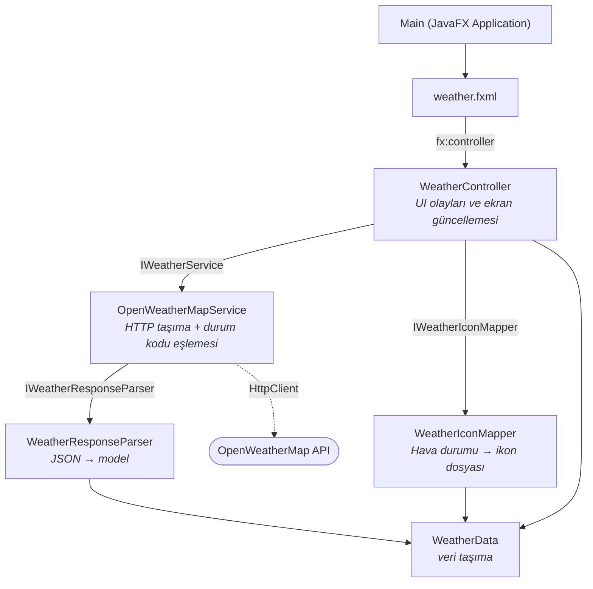

# 🌤️ WeatherApp

JavaFX ile yazılmış masaüstü hava durumu uygulaması. OpenWeatherMap API'sinden gerçek
zamanlı veri çeker, katmanlı ve test edilebilir bir mimari üzerine kuruludur.

[](https://github.com/emrelab/weather-app/actions/workflows/ci.yml)
[](LICENSE)
[](https://adoptium.net/)
[](https://openjfx.io/)

## Ekran görüntüsü


## Özellikler

- Şehir bazlı arama, gerçek zamanlı hava durumu verisi
- Sıcaklık, hissedilen sıcaklık, min/max, nem ve rüzgar hızı gösterimi
- Hava durumuna göre dinamik ikonlar
- Ağ işlemleri arka planda; arayüz donmaz
- Kullanıcıya ham exception metni veya hata kodu gösterilmez — her hata durumu
  Türkçe, okunabilir bir mesaja eşlenir (şehir bulunamadı, geçersiz API anahtarı,
  limit aşıldı, bağlantı yok, …)
- 64 birim testi, 3 işletim sisteminde CI

## Mimari

Katmanlar tek yönlü bağımlıdır; UI katmanı somut servislere değil arayüzlere bağlıdır.



### SOLID eşlemesi

| Prensip | Uygulama |
|---|---|
| **S** — Single Responsibility | `OpenWeatherMapService` yalnızca HTTP taşıma ve durum kodu eşlemesi yapar; JSON çözümleme `WeatherResponseParser`'a, ikon seçimi `WeatherIconMapper`'a, ekran güncellemesi `WeatherController`'a aittir |
| **O** — Open/Closed | Yeni bir sağlayıcı (ör. farklı bir hava durumu API'si) `IWeatherService` implement edilerek eklenir; mevcut sınıflar değişmez |
| **L** — Liskov Substitution | Testler herhangi bir `IWeatherService` / `IWeatherResponseParser` implementasyonuyla çalışır |
| **I** — Interface Segregation | `IWeatherService`, `IWeatherIconMapper`, `IWeatherResponseParser` — her biri tek ve dar bir sözleşme |
| **D** — Dependency Inversion | `WeatherController` somut sınıflara değil arayüzlere bağlıdır; somut nesneler yalnızca composition root'ta (varsayılan constructor) oluşturulur |

## Teknolojiler

| Teknoloji | Sürüm | Kullanım |
|---|---|---|
| Java | 17 (LTS) | Platform, `java.net.http.HttpClient`, switch expression, text block |
| JavaFX | 17.0.15 | Arayüz, FXML |
| Maven | 3.x (wrapper dahil) | Build, test |
| JUnit 5 | 5.10.2 | Birim ve entegrasyon testleri |
| org.json | 20231013 | JSON çözümleme |
| OpenWeatherMap API | 2.5 | Hava durumu verisi |

## Başlarken

### Gereksinimler

- JDK 17 veya üzeri (`java -version` ile kontrol edin)
- İnternet bağlantısı

Projeyi klonlayıp çalıştırın — Maven kurmanıza gerek yok, wrapper geliyor:

```bash
git clone https://github.com/emrelab/weather-app.git
cd weather-app
./mvnw clean javafx:run
```

Windows'ta: `mvnw.cmd clean javafx:run`

### API anahtarı

Uygulama [OpenWeatherMap](https://openweathermap.org/api) API anahtarı gerektirir.
Anahtar **kaynak kodda tutulmaz**, `OWM_API_KEY` ortam değişkeninden okunur.

```bash
# macOS / Linux
export OWM_API_KEY="buraya_anahtariniz"

# Windows (PowerShell)
$env:OWM_API_KEY="buraya_anahtariniz"

# Windows (cmd)
set OWM_API_KEY=buraya_anahtariniz
```

Anahtar tanımlı değilse uygulama çökmez; arayüzde anlaşılır bir uyarı gösterilir.

IntelliJ IDEA ile çalıştırırken: **Run → Edit Configurations → Environment variables**
alanına `OWM_API_KEY=...` ekleyin.

## Testler

```bash
./mvnw test
```

64 test, 3 sınıf:

| Test sınıfı | Kapsam |
|---|---|
| `WeatherIconMapperTest` | Tüm OpenWeatherMap ikon kodları, `main` alanına geri düşme, harf duyarsızlık, bilinmeyen/eksik kod, `null` güvenliği |
| `WeatherResponseParserTest` | Tam/eksik yanıtlar, boş ve bozuk gövde, zorunlu alan eksikleri, kök nedenin korunması |
| `OpenWeatherMapServiceTest` | Gerçek HTTP üzerinden durum kodu eşlemesi (200/401/404/429/500), URL kodlaması, erişilemeyen sunucu, ağ isteği yapılmadan reddetme |

Servis testleri gerçek bir soket üzerinden çalışır; `StubHttpServer` sahte API görevi
görür. Böylece URL kurulumu, hata eşlemesi ve JSON çözümleme birlikte doğrulanır —
ne gerçek ağa ne de harici bir mock kütüphanesine ihtiyaç duyulur.

## Proje yapısı

```
src/main/java/com/weather/
├── Main.java                       # JavaFX giriş noktası
├── WeatherController.java          # UI olayları, ekran güncellemesi
├── model/
│   └── WeatherData.java            # Veri modeli
├── service/
│   ├── IWeatherService.java        # Servis sözleşmesi
│   ├── OpenWeatherMapService.java  # HTTP taşıma + durum kodu eşlemesi
│   ├── IWeatherResponseParser.java # Parser sözleşmesi
│   ├── WeatherResponseParser.java  # JSON → model
│   └── WeatherServiceException.java
└── mapper/
    ├── IWeatherIconMapper.java     # İkon eşleme sözleşmesi
    └── WeatherIconMapper.java      # Hava durumu → ikon dosyası

src/main/java/module-info.java      # JPMS modül tanımı
src/main/resources/com/weather/     # FXML ve ikon dosyaları
src/test/java/com/weather/          # JUnit 5 testleri
```

## Yol haritası

- [ ] Arayüz testleri (TestFX)

## Lisans

[MIT](LICENSE) © 2026 Yunus Emre Karaman
